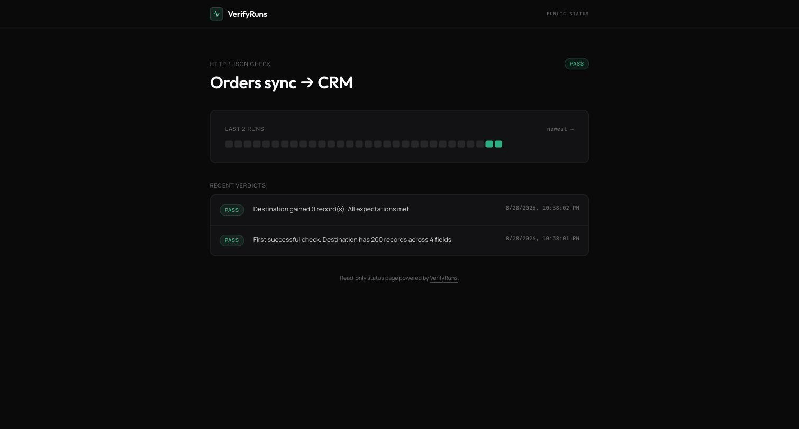

# VerifyRuns

**Your automation said Done. VerifyRuns checks if that's true.**

n8n, Make and Zapier workflows finish green while silently writing nothing — or the wrong thing — to the destination. Every monitoring tool watches the *run*. VerifyRuns re-reads the *destination* after each run, fingerprints it, diffs it against the last 30 good runs, and tells you in plain English when a "successful" workflow didn't actually land:

```
FAIL — airtable-orders-sync
Run reported success, but your workflow said it wrote 3 records; the destination gained 0,
and the field `price` disappeared — it was present in the last 30 good runs.
```



## How it works

1. **Create a Check** — point VerifyRuns at your destination (an HTTP/JSON endpoint, an Airtable table, or a read-only Postgres query) and set expectations: growth per run, required fields, fields that must be non-empty.
2. **Paste the webhook** — add one HTTP Request node at the end of your workflow that POSTs to the Check's secret URL. Optionally tell VerifyRuns what the workflow believes it wrote:
   ```bash
   curl -X POST "https://<your-host>/api/hook/<secret>" \
        -H "content-type: application/json" -d '{"wrote": 3}'
   ```
   A workflow that knows it failed can say so — `{"status": "failed", "error": "step 4 timed out"}` — and the run is a FAIL with that reason, whatever the destination shows (your error workflow or a cron wrapper's non-zero exit is the usual sender).
3. **Get verdicts** — every run is PASS or FAIL with a diff message. Slack, Discord and email channels get a message on the first FAIL and again on recovery; not on every red run.

Per-platform setup: [n8n](docs/n8n.md) · [Make](docs/make.md) · [Zapier](docs/zapier.md). The webhook returns the verdict in the same request; the n8n community node ([`n8n-nodes-verifyruns`](https://www.npmjs.com/package/n8n-nodes-verifyruns)) does that and fails the execution on FAIL.

## Connectors

| Connector | Config | Count | Newest record |
|---|---|---|---|
| HTTP / JSON | GET URL, optional bearer token, optional JSON path to the array, optional `newest_key` | length of the array | max of `newest_key`, else the last element |
| Airtable | base id, table, optional view, personal access token | true count via `offset` paging (ceiling 4,000; beyond it the count is marked capped and growth rules stand down) | newest `createdTime` |
| Postgres | connection string (TLS unless `sslmode=disable`; on the hosted build the certificate must be publicly trusted — see `docs/deploy.md`), a single read-only `SELECT`/`WITH` | `COUNT(*)` of the query | the query's own `ORDER BY … DESC`; without one, newest-record rules are skipped and the run says so |

Secrets are encrypted at rest with AES-256-GCM and only ever shown masked to their last four characters. All destination reads happen server-side.

## Verdict rules

- **Growth** — the destination must gain at least `min_new_records` (the New Check form defaults to 0, "growth optional"; set 1 to assert every run adds a record), or at least what the workflow claimed with `{"wrote": N}`.
- **Steady** — the count must not change (lookup tables, config rows).
- **Claimed** — every webhook run must send `{"wrote": N}`; the destination must gain N.
- **Required fields** must be present; a field present in every one of the last 30 good runs that disappears is a FAIL.
- **Non-empty fields** — FAIL only when the newest record is empty *and* so is the majority of the five newest, so one odd row cannot flip a verdict.
- **Heartbeat** — "expect a run every N hours": if no run arrives in the window, VerifyRuns records a FAIL ("No run in 26 h — expected one every 24 h.") and alerts; the next real run recovers it. This catches the workflow that never fired, not just the one that fired and wrote nothing. A workflow that only runs in office hours can add an active window ("only during 09:00–17:00 Europe/Berlin, weekdays"): the clock stops outside it, so an hourly job is due one *active* hour after its last run — Friday 16:00 becomes Monday 10:00 — instead of needing a 17-hour cadence to survive the night.

The engine is deterministic code — no model, no score you cannot inspect. Every rule is a pure function with tests in `worker/test/`.

## Run it yourself

API: a Cloudflare Worker with D1 (`worker/`, TypeScript); the original FastAPI + MongoDB build lives in git history (tag `python-backend-final`). Frontend: React 19 + Tailwind + shadcn/ui (yarn — it is pinned via `packageManager`). Deployment: [docs/deploy.md](docs/deploy.md) — Workers + D1 + Pages, $0.

```bash
# API (Cloudflare Worker, runs locally in workerd)
cd worker && npm install
cp .dev.vars.example .dev.vars      # replace the three placeholder secrets
npm run migrate:local
npm run dev                         # http://localhost:8787

# Frontend
cd ../frontend && yarn install
echo 'REACT_APP_BACKEND_URL=http://localhost:8787' > .env
PORT=3100 yarn start
```

## Tests

```bash
cd worker
npm test                            # vitest inside workerd with a real D1; Postgres tests use Docker pg on 127.0.0.1:5434 and skip when it is absent
npm run typecheck
```

By default a run stores counts, field names and a hash of the newest row — never the rows themselves; raw samples are an opt-in with a 30-day expiry. Details in [docs/what-we-store.md](docs/what-we-store.md).

The maintainer's own scheduled jobs report to VerifyRuns as a standing test fleet: [docs/dogfood.md](docs/dogfood.md).

## Roadmap

Planned work is tracked with [OpenSpec](https://github.com/Fission-AI/OpenSpec) in [`openspec/`](openspec/): `specs/` describes the behaviour as built, `changes/` holds one folder per proposal with its design, requirement deltas and task list. `openspec list` shows what is in flight.

## Status

Built for the Emergent Builder Fest (August 2026); developed locally since 2026-08-27. Alpha — the API and data model may change. Security disclosures: [docs/security.md](docs/security.md). Terms: [docs/terms.md](docs/terms.md); privacy: [docs/privacy.md](docs/privacy.md).
